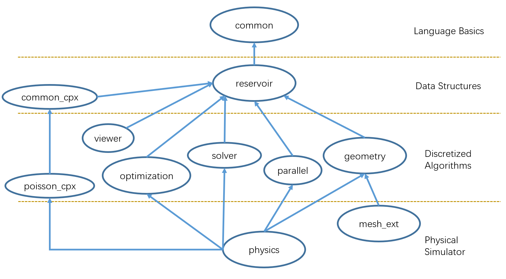

  # Code checkout

### Cloning via SSH

If you created your GitLab account using a third-party login (Google, GitHub, etc.), you will likely be unable to clone the respository via HTTPS. However, you can clone it with SSH.

### Generating an SSH Key
1.  Make sure `git` is installed on your computer. If not, please see the instructions https://git-scm.com/book/en/v2/Getting-Started-Installing-Git. Open a shell (for example, `Powershell`, `cmd`, `Git Bash`) on your computer. You can check if `git` is installed by executing the following command command:

        > git --version

      A valid version should show up.
2.  Create a New SSH Key with your email as the label        

        > ssh-keygen -t rsa -b 4096 -C "your_email@example.com"
3. Save the SSH Key in the default location by pressing enter when asked to specify a location

        > Enter a file in which to save the key (/c/Users/you/.ssh/id_rsa):[Press enter]

4. Type a secure password for your SSH Key when prompted

        > Enter passphrase (empty for no passphrase): [Type a passphrase]
        > Enter same passphrase again: [Type passphrase again]

### Adding the SSH key to your GitLab account

1. Copy the SSH key to your clipboard

        > clip < ~/.ssh/id_rsa.pub

    (If that doesn't work, you can use `cat ~/.ssh/id_rsa.pub` and manually copy the file content. Or you can just open the file in File Explorer and copy everything.)

2. Open https://gitlab.com/-/profile/preferences, navigate to `SSH Keys` among the tabs on the left column. Paste in the copied SSH key, set a title (a name for the computer you're using), and press "Add Key."

### Clone the project

After the `SSH key` is set, the repository can now be cloned with SSH

        > git clone git@gitlab.com:boolzhu/simplex.git

# Compile and run the sample code
Check the sample projects under /proj. For example, `fluid_euler` is a sample project simulating fluid with Eulerian grid method, and `fluid_SPH` simulates fluid with a particle system. Now we'll show you how to compile these projects.

For the first step, you need to build /proj/_install to generate .lib files for all the external and internal libraries.

### Prerequisites

Before starting, you need to make sure of a few things:

1. **Compiler.** On `Windows` system, make sure you have installed `Visual Studio 2019` (must be this exact version, because `CUDA` does not support `Visual Studio 2022` integration yet). On `Linux` systems, make sure you have `g++ >= 5` version (because we use C++17 standard. You don't need to worry about it at most times, though).
2. **CMake.** Be sure you have `CMake >= 3.18` command line installed. You can refer to `CMake`'s official page https://cmake.org/install/ for install instructions, and I personally recommend you to use [Chocolatey](https://chocolatey.org/) package manager, something like `apt` if you're using a `Windows` system. You should check `CMake` installation by typing `cmake --version` in some shell. If that fails, please check the path to `CMake.exe` (or `cmake` in Linux) executable file is set in system environment `PATH`.
3. **Python.** Please make sure you have `Python3` installed.
4. **(Optional) CUDA.** Install `CUDA Toolkit 11.6` if you want to enable GPU features. See https://developer.nvidia.com/cuda-downloads for instructions. You usually need this because you can simulate much larger systems with GPU, although it's optional. On `Windows`, You should install `CUDA` **after** installing `Visual Studio`, because only in this way `CUDA` can properly install `Visual Studio` integration.
5. **(Optional) cuDNN.** If you want to use `libtorch` in the code, you need to install `cuDNN` library. It's an independent additional package to `CUDA`. See https://docs.nvidia.com/deeplearning/cudnn/install-guide/index.html for instructions. You need to copy some files on `Windows`, be prepare for that:)

### Build third-party libraries

**You only need to build this _install once after your first build (or after some third-party library(s) are updated).**

##### Step 1

Execute following commands:

    > cd simplex
    > python3 make_project.py _install

> Note: `make_project.py` is a `Python` script for generating build files. The grammar of that script is simple: `python3 make_project.py _install` means generating build files for project `simplex/proj/install`. An equivalent way is `python3 make_project.py simplex _install`. You can also use it to generate `complex` projects, for example: `python3 make_project.py complex drone`.

You should see some information printed ended with something like

    -- Configuring done
    -- Generating done
    -- Build files have been written to: D:/Codes/simplex/build/_install

##### Step 2

In `Windows`, open `simplex/build/_install/_install.sln` and build all (be aware of the compilation mode: `Debug`/`Release`/..., it corresponds to the compilation mode in project).

In `Linux`, execute following commands:

    > cd simplex/build/_install
    > make

Note that this command automatically build binary files in `Release` mode, which is faster than `Debug`. If you want the latter one, we currently don't support it in `make_project.py`, however you can use `cmake simplex/proj/_install -DCMAKE_BUILD_TYPE=Debug` to manually generate build files.

### Build OpenGL viewer

Repeat these two steps, but change `_install` to `opengl_viewer`. Basically you'll do `python3 make_project.py opengl_viewer`, and compile. The generated executable file is `simplex/bin/opengl_viewer/Release/opengl_viewer.exe`. It only works for `Windows` now.

### Build and run project

Repeat the two steps to build the simulation project.

**Note: we use CPM package manager to automatically install some third-party libraries. Especially, if you are generating some project using `libtorch` for the first time, the `CMake` process can be rather slow because it will download a very large file containing the whole `libtorch` package from Internet. In this case, just be patient and wait a while.**

For example, you can do that for `fluid_euler`. Navigate to the folder of the executable file (something like `simplex/bin/fluid_euler/Release`, or you can find any other place not messing up the git repo to do this), and execute the file. For example:

    > fluid_euler.exe -test 3 -s 64 -lf 200 -o water

    Arguments:
    -test: 3, droplet falling into water; 4. droplet oscillation with surface tension
    -s: resolution
    -lf: last frame
    -o: output folder

To visualize it, you can call `opengl_viewer.exe` by its path, or just copy the executable along with two `dll`s in the same folder to your current folder. Then run

    > opengl_viewer.exe -m fluid -o water

For another example, you can compile `fluid_SPH` and

    > fluid_SPH.exe -driver 2 -test 2 -s 16 -lf 100 -o bowl
    > opengl_viewer.exe -m fluid_lag -o bowl

Our OpenGL Viewer provides different functions. You can use it to check the simulation results at first time, and also use it to debug. Especially we support a color encoding mode, in which you can see the index number of a particle in a geometric particle system. See the manual for details ([EN](/docs/viewer-usage.md)).

## OpenGL on Linux

Add these lines to `~/.bashrc`:

    export MESA_GL_VERSION_OVERRIDE=4.5
    export MESA_GLSL_VERSION_OVERRIDE=450

## Remote OpenGL via VNC remote desktop:

Follow the instructions [here](docs/vnc.md) to set up remote desktop via VNC and use the OpenGL viewer remotely.

# Simplex structure

# Third-party libraries

`simplex` supports a number of third-party libraries. You can use `use_ext_libs()` command in project's CMakeLists.txt to conveniently include them into your project. Here we list all third-party libraries supported in `simplex`. See `simplex/script/ext_config.cmake` for details.

You may note that some of them are carried along with `simplex` in `ext` folder. **Next we'll try to just use `CPM` package manager to support most of them.**

For `Type` field, `H` means it's a header-only library. `H&B` means it includes header files and binary files (e.g., `.dll` files). `F` means it includes header files and binary files, and is added to the project by a `find_package` command in `CMake`. Here `opengl` is a special one. It's `H&B` on `Windows`, and added as compiling flags on `Linux`.

For `simplex Integration` field, a path means all resources needed by this library is carried with `simplex` in this path. `CPM` means it's automatically downloaded (if needed) and installed by `CPM` package manager. `SYS` means you need to install it manually in your operating system.

| Name | Version | Type | `simplex` Integration | Description & Comments |
| :--- | :------ | :--- | :----------- | :--------------------- |
|amgcl||H|`ext/amgcl`||
|autodiff||H|`ext/autodiff`||
| eigen| 3.3.8   | H |`ext/eigen` | Linear algebra library. The lib in `ext/eigen` has been manually modified to resolve some certain compilation errors, so `CPM` does not work for this version.|
|fmt|8.0.1|H|CPM|Formatting library, allow python-style formatting in C++.|
|glm|0.9.9.0|H|`ext/glm`|Auto installed along with `opengl` option. It's a non-standrad strange ancient version which claims its version to be `0.99`.|
|libigl|2.3.0|H|CPM|Geometry processing library|
|nlohmann_json|3.10.3|H|CPM|Json library to configure simulation systems. |
|nanoflann|1.3.2|H|CPM|A fast K-D tree library.|
|nlopt||H|`ext/nlopt`||
|perlin_noise||H|`ext/perlin_noise`||
|physbam||H|`ext/physbam`||
|ipopt||H&B|`ext/ipopt`||
|imgui||H&B|`ext/imgui`||
|mma||H&B|`ext/mma`||
|polyscope|1.2.0.0|H&B|CPM|Independent fork: https://github.com/leqiqin/polyscope. A viewer to visualize mesh and point cloud. CMake script will add polyscope as a dependency target to the project, and compile it along with project.|
|stb||H&B|`ext/stb`||
|tetgen||H&B|`ext/tetgen`||
|tiny_obj_loader||H&B|`ext/tiny_obj_loader`||
|tri2d||H&B|`ext/tri2d`||
|cuda|11.6|F|SYS&CPM|You need to install `CUDA 11.6` manually on your system. However you don't need to install `CUDA Samples`, `CPM` will do that.|
|libtorch|1.9.1|F|CPM&SYS|`libtorch 1.9.1` supports `CUDA 11.1`. You don't need to install `libtorch` itself, it's done by CPM. However you need to install `cuDNN` manually to use `libtorch`.|
|opengl||-|`ext/glm`, `ext/freeglut`, SYSTEM|On `Windows` system you don't need to install `OpenGL`, all resources are carried in `simplex`. However in `Linux` you need to install it manually.|
|openmp||F|SYS||

# Generate animation movies

1. In the viewer, press `w` to turn on the offscreen rendering mode. Then press `p` to play the animation in the viewer. A sequence of frames will be written to `[your output path]/_images` (e.g., `water/_images`)

2. Use ffmpeg to generate video.

    ffmpeg -framerate 25 -i [output]/_images/%4d.png -c:v libx264 -vf scale=640:-1 -pix_fmt yuv420p [output]/_images/out.mp4
    ffmpeg -framerate 25 -i [output]/_images/%4d.png -c:v libx264 -vf "crop=trunc(iw/2)*2:trunc(ih/2)*2" -pix_fmt yuv420p [output]/_images/out.mp4

(Reference: https://trac.ffmpeg.org/wiki/Slideshow)
(Reference: https://stackoverflow.com/questions/20847674/ffmpeg-libx264-height-not-divisible-by-2/29582287#29582287)

If you use WSL, you may create a bash file for templaterized command call (see a bash file in `simplex/script/ani.bash` for example). You may also add command aliases in the WSL .bashrc file (like Windows environmental variables) for quick access:

    cd ~
    (goto home dir)
    nano .bashrc
    (open the .bashrc file with nano)

Then append the following text to the end of the file and save the file:

    # customized aliases
    alias ani='[Your path]/simplex/script/ani.bash'

    source .bashrc
    (update the aliases)

# How to start your own project

## Programming style guide

Please see our code specification guide ([EN](/docs/code-specification.md)) before you start to write codes.

## How to write CMakeLists.txt

If you want to create a own project, or add a library to `simplex/src` or `simplex/ext`, you need to write a CMakeLists.txt file. Please see our compilation documentation to know how to do that ([中文](/docs/compilation-notes-zh.md)).

If you want to modify our cmake script files, please see the notes ([中文](/docs/cmake-dev-zh.md)), and contact with `simplex` infrastructure develop team.

## How to read simulator parameters from file

You can read parameters of your simulator (i.e., the fluid density, viscosity, atmosphere pressure...) from a file. We provide an easy-to-use interface ([中文](/docs/fileinit-usage.md)) for this purpose with strong automatic error detections.

## Profile your code
You can use `Timer` class to record the instantaneous/avaerage time of each part of your main loop([中文](/docs/timer-usage-zh.md)).
